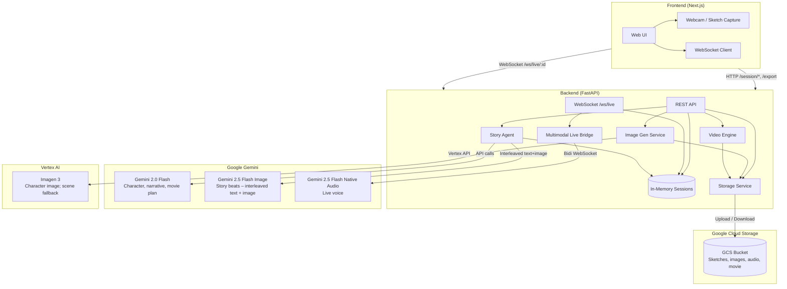

# KidSketch Storyteller

A children's storytelling app that turns a kid's sketch into a character, generates an interactive story with AI, supports live voice conversation with the character, and exports the story as an animated movie.

**Mandatory tech:** Story beats use **Gemini's interleaved output** (text and image in a single response); Vertex Imagen 3 is used for the character image and as fallback when a beat has no inline image.

---

## Summary

KidSketch Storyteller lets a child **draw a character** (e.g., via webcam or upload). The app uses **Gemini** to analyze the drawing and create a character profile, **Vertex AI Imagen 3** to generate a polished character image, and **Gemini** (with interleaved text+image output) to produce story beats—narration and scene images in a single response. When Gemini doesn’t return an image, **Imagen 3** is used as fallback for the scene. The child can **talk to the character** in real time via **Gemini Multimodal Live** (voice-in, voice-out). Story beats are assembled into an **animated movie** (FFmpeg + gTTS) and stored in **Google Cloud Storage**. All session state is held **in memory** in the backend; media assets (sketches, images, audio, final video) are persisted in GCS.

---

## Features and Functionality

| Feature | Description |
|--------|--------------|
| **Sketch capture** | Child captures a drawing (e.g., via webcam). |
| **Character analysis** | Gemini analyzes the sketch and returns a structured character profile (name, description, visual traits). |
| **Character image** | A detailed Imagen 3 prompt is generated from the profile; Vertex Imagen 3 produces a polished character image. |
| **Story beats** | Gemini (image-capable model) generates the next story beat with interleaved text and optional inline image (title, narration, scene illustration in one response). Character reference image and style instructions keep the same look across scenes. If no image is returned, Gemini is retried once; if still no image, Vertex Imagen 3 is used as fallback. When no scene image is available, a placeholder is shown (the original sketch is never used as a beat image). User can steer with text or voice (e.g., “go to the moon”). |
| **Narrative state** | User instructions update story world state (setting, continuity facts) via Gemini before generating the next beat. |
| **Live voice** | WebSocket from frontend to backend; backend proxies to Gemini Multimodal Live (native audio). Child talks to the character; character responds with audio. Optional transcript can trigger a new story beat. |
| **Export movie** | Story beats are turned into a movie plan (shots with narration, images, motion). gTTS generates narration audio; FFmpeg produces a single video; result is uploaded to GCS and a URL is returned. |

---

## Technologies Used

| Layer | Technology |
|-------|------------|
| **Frontend** | Next.js 16, React 19, TypeScript, Tailwind CSS, Lucide React, react-webcam |
| **Backend** | FastAPI, Uvicorn, Pydantic, WebSockets, python-dotenv |
| **AI – text / planning** | Google Gemini (google-genai): character analysis, character prompt, narrative update, movie plan (Gemini 2.0 Flash); story beats use Gemini 2.5 Flash Image with interleaved text+image output. Prompt-injection mitigations: input sanitization, system vs. user separation, output length limits. |
| **AI – image** | Gemini 2.5 Flash Image for story-beat scene images (interleaved with text); Vertex AI Imagen 3 (google-cloud-aiplatform) for character image and as fallback when a beat has no inline image. |
| **AI – voice** | Gemini Multimodal Live (Gemini 2.5 Flash Native Audio) via WebSocket; backend bridges client WebSocket to Gemini Bidi API |
| **Storage** | Google Cloud Storage (google-cloud-storage): sketches, character image, beat images, TTS audio, final movie |
| **Media pipeline** | gTTS for narration audio, FFmpeg (ffmpeg-python) for animated movie assembly, Pillow for image handling |
| **Other** | aiohttp, requests for HTTP; in-memory session store (no database) |

---

## Data Sources

- **Google Cloud Storage (GCS)**  
  Single persistent data store. Holds: session sketches, generated character image, per-beat images, TTS audio files, and the exported movie file. Backend uses a configurable bucket (`GCS_BUCKET_NAME`).

- **In-memory session store**  
  Session state (character profile, story plan, history of beats, etc.) lives in a Python dict keyed by `session_id`. No database; restart clears sessions.

- **External APIs**  
  - **Gemini API** (google-genai): character analysis, story/narrative/movie-plan generation.  
  - **Gemini Multimodal Live** (WebSocket): real-time voice conversation.  
  - **Vertex AI** (Imagen 3): character image generation and fallback for story-beat scene images when Gemini does not return one.  
  No other third-party data sources (e.g., no Firestore in the current flow; it appears only in backend requirements for possible future use).

---

## Architecture Diagram

The diagram below shows how the frontend, backend, Gemini (text and live), Vertex Imagen, and GCS connect.

**Flow summary:**

1. **Frontend** sends sketch (e.g., from webcam) to backend **REST** → **Session init** and **Analyze**.
2. **Story Agent** calls **Gemini** for profile and character prompt; **Image Gen** calls **Vertex Imagen 3** for character image; **Storage** saves sketch and image to **GCS**.
3. **Story beats**: REST with optional `user_instruction` → **Story Agent** (Gemini 2.5 Flash Image, with character reference for style consistency) → next beat with optional inline image; if no image, one retry; if still none, **Image Gen** (Imagen 3) → scene image (or placeholder); **Storage** (GCS).
4. **Live voice**: Frontend opens **WebSocket** to backend; **Multimodal Live Bridge** connects to **Gemini Multimodal Live**; audio is proxied both ways; backend can use transcript to trigger a new beat (REST).
5. **Export**: REST **Export** → **Video Engine** builds movie from beats (gTTS + FFmpeg), **Storage** uploads movie to **GCS**, backend returns movie URL.

---

## Environment and Run

- **Backend**: Set `GEMINI_API_KEY`, `GOOGLE_CLOUD_PROJECT`, `GCS_BUCKET_NAME`, and optionally `ALLOWED_ORIGINS`. Run from `backend/` with `python main.py` or `uvicorn main:app --host 0.0.0.0 --port 8000`.
- **Frontend**: Set `NEXT_PUBLIC_API_URL` (e.g. `http://localhost:8000`). Run from `frontend/` with `npm run dev` (default port 3000).

---

## License and Contributing

See repository root for license and contribution guidelines.
